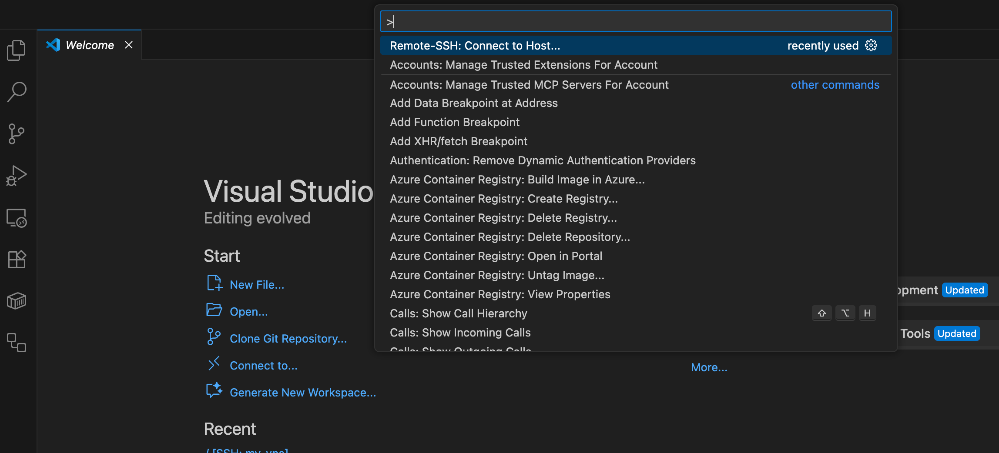
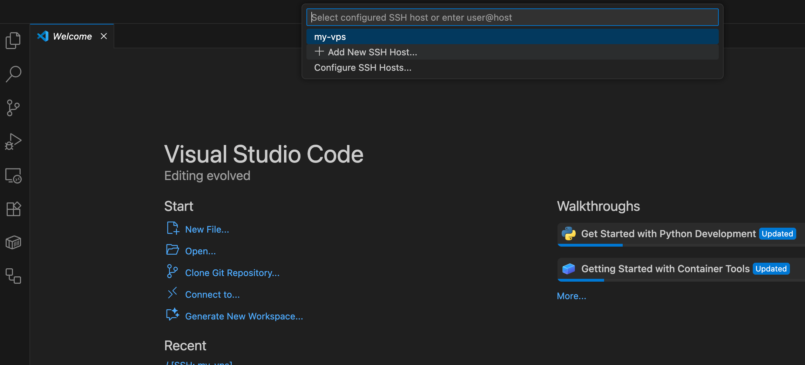
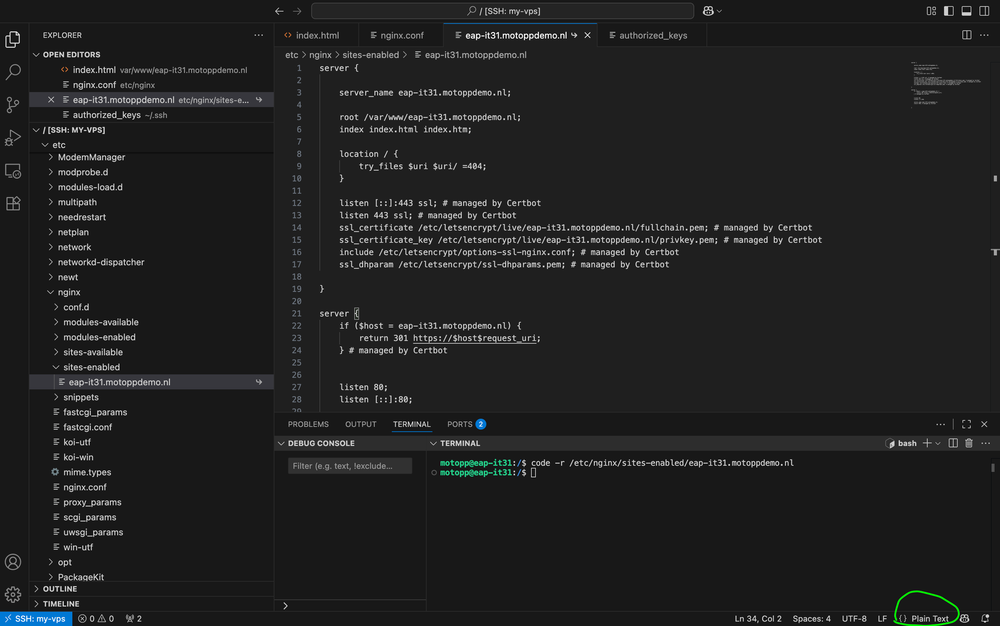

# Working with Visual Studio Code

## Install extensions

- nginx.conf
- Remote - SSH

Side note: `cmd + shift + .` to show hidden files and folders.

---

## Then

Open VS Code  

Press `Ctrl + Shift + P`  

Run:

```
Remote-SSH: Connect to Host
```


Add your VPS:
Select ```Remote SSH: Add New SSH Host``` and add your host: 

```
ssh user@your-server-ip
```


Then VS Code opens the remote machine like a local workspace.

You get:

- ✅ File explorer
- ✅ Syntax highlighting
- ✅ Search
- ✅ Terminal
- ✅ Copy/paste files
- ✅ No nano needed

You can browse:

```
/etc/nginx/
```

and:

```
/var/www/
```

like normal folders.

---

## Open a file or folder with the terminal

To open a file or folder with the terminal, use:

```
code -r /path/to/your/file/or/folder
```

---

# VS Code nginx syntax highlighting

VS Code doesn’t always recognize nginx config files automatically — especially when they don’t have a `.conf` extension, like:

```
/etc/nginx/sites-enabled/eap-it31.motoppdemo.nl
```

VS Code just treats it as plain text.

---

## ✅ Fix for the current file (one-time)

At the bottom-right corner of VS Code:

Click where it says **Plain Text**



Type:

```
nginx
```

Select nginx

Syntax highlighting should appear immediately.

---

## ✅ Permanent fix (recommended)

Tell VS Code to treat nginx config paths as nginx files.

Open VS Code settings JSON:

`Ctrl+Shift+P → Preferences: Open Settings (JSON)`

Add:

```json
"files.associations": {
    "/etc/nginx/sites-available/*": "nginx",
    "/etc/nginx/sites-enabled/*": "nginx",
    "*.conf": "nginx"
}
```

Now nginx configs will always open with highlighting.

(The permanent fix did not work for me)


---

# Nginx configuration structure

Nginx main configuration file:

```
/etc/nginx/nginx.conf
```

The main config file imports this sub-configuration file and uses it:

```
/etc/nginx/sites-enabled/eap-it31.motoppdemo.nl
```

What's this file then? /var/www/eap-it31.motoppdemo.nl/index.html looks like it's the file nginx is serving in eap-it31.motoppdemo.nl